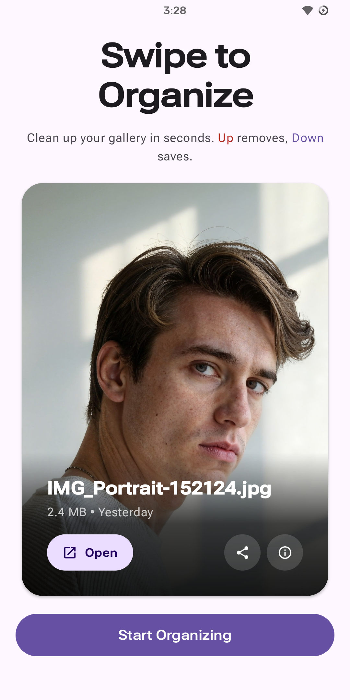
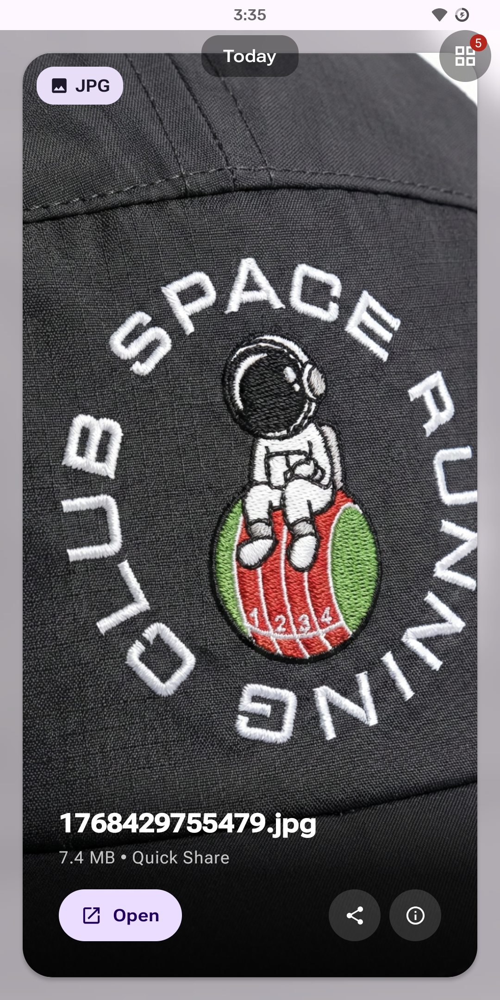
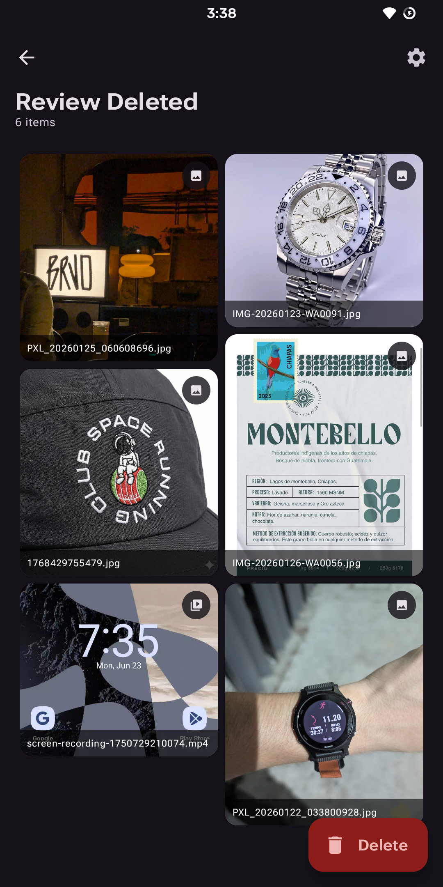
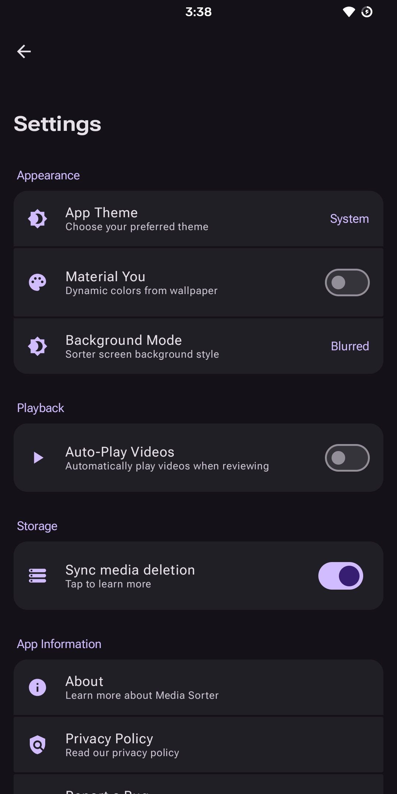

# Sorter

  

  <strong>Minimal,easy to use and expressive media sorter for Android.</strong> 
  Built with Jetpack Compose and Material Design 3

  
  
  
  
  
  

  
  
  
  
  

> This app solves the common problem of cluttered photo galleries by
> making the cleanup process quick, fun, and safe with its modern,
> gesture-driven interface.

---

### Core Features

- Swipe-Based Sorting: Swipe down to keep photos/videos, swipe up to delete
- Review System: Preview deleted items in a zoomable grid before permanent deletion
- Advanced Media Viewer: Pinch-to-zoom images, play videos with progress control, fullscreen mode
- Material Design 3: Dynamic colors, smooth animations, predictive back gestures
- Customizable Settings: Light/Dark/System themes, Material You colors, blurred backgrounds
- Undo & Batch Actions: Restore individual items or delete all at once

### Technical Highlights

| Category                  | Technology                                                                     |
|---------------------------|--------------------------------------------------------------------------------|
| **Language**              | [Kotlin](https://kotlinlang.org/) 100%                                         |
| **UI Framework**          | [Jetpack Compose](https://developer.android.com/jetpack/compose)               |
| **Design System**         | [Material Design 3](https://m3.material.io/)                                   |
| **Architecture**          | MVVM with StateFlow/SharedFlow                                                 |
| **DI**                    | [Hilt](https://dagger.dev/hilt/)                                               |
| **Database**              | [DataStore](https://developer.android.com/jetpack/androidx/releases/datastore) |
| **Image Loading**         | [Coil](https://coil-kt.github.io/coil/)                                        |
| **Zoomable Image Buffer** | [Telephoto](https://github.com/saket/telephoto)                                |
| **Async**                 | Kotlin Coroutines & Flow                                                       |

## Download

  

Download the latest APK from the [Releases](https://github.com/isaacsa51/Sorter/releases) page.

> Soon on Play Store and F-Droid

---

## Contributing

Contributions are welcome! Please feel free to submit a Pull Request.

**Quick Start:**
1. Fork the Project
2. Create your Feature Branch (`git checkout -b feature/AmazingFeature`)
3. Run local checks: `./gradlew lint detekt testDebugUnitTest assembleDebug`
4. Commit your Changes (`git commit -m 'Add some AmazingFeature'`)
5. Push to the Branch (`git push origin feature/AmazingFeature`)
6. Open a Pull Request (use the PR template)

**CI/CD:** 
- All PRs are automatically checked with Android Lint, Detekt static analysis, unit tests, and build verification
- Releases are automatically built and published when tags are pushed
- Changelogs are auto-generated from commit history and merged PRs

See [Contributing Guidelines](.github/CONTRIBUTING.md) for detailed information.

---

## License

This project is licensed under the MIT License - see the [LICENSE](LICENSE) file for details.

---

  Made  & dedicated to my mom with ❤️,  by <a href="https://github.com/isaacsa51">Isaac Serrano</a>

